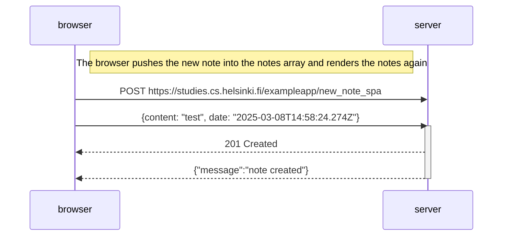

```mermaid
sequenceDiagram
    participant browser
    participant server

    Note right of browser: The browser pushes the new note into the notes array and renders the notes again

    browser->>server: POST https://studies.cs.helsinki.fi/exampleapp/new_note_spa
    browser->>server: {content: "test", date: "2025-03-08T14:58:24.274Z"}
    activate server
    server-->>browser: 201 Created
    server-->>browser: {"message":"note created"}
    deactivate server
```